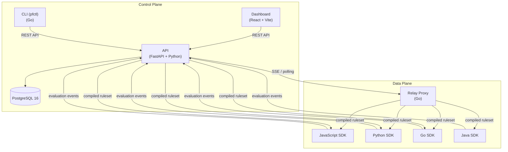
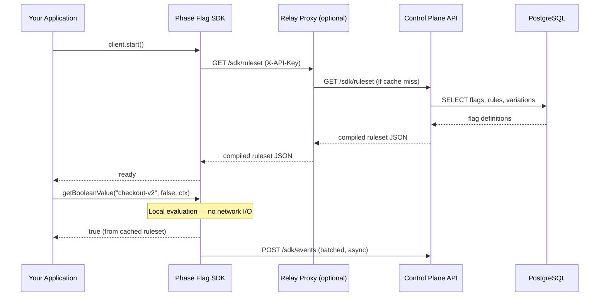

# Architecture Overview

Phase Flag follows a **control-plane / data-plane** architecture that separates flag management from flag evaluation. This design means your application never needs a network round-trip to evaluate a flag.

---

## System Diagram



---

## Components

### Control Plane (API)

The control plane is a **FastAPI** application — the single source of truth for all flag configuration, targeting rules, and governance workflows.

**Technology stack:**
- Python 3.11, FastAPI 0.109, async SQLAlchemy 2.0, Pydantic v2
- PostgreSQL 16 (asyncpg driver)
- JWT tokens and API keys for authentication
- Role-based access control: `admin`, `editor`, `viewer`
- Alembic for schema migrations

**Key responsibilities:**
- Flag CRUD and lifecycle management (draft → active → stale → archived)
- Targeting rule and segment management
- Audit logging for all mutations (actor, timestamp, before/after diff)
- Webhook delivery on flag state changes
- Server-Sent Events (SSE) streaming for real-time ruleset distribution
- REST API for dashboard, CLI, CI/CD integrations, and SDKs

### Data Plane (SDKs + Relay)

The data plane handles flag evaluation at the point of use. SDKs download a **compiled ruleset** from the control plane and evaluate flags **locally** for sub-millisecond latency.

#### SDK Evaluation Flow

```
1. SDK.start() → GET /api/v1/sdk/ruleset  (authenticated with SDK API key)
2. Ruleset cached in memory (flags, targeting rules, variations)
3. getBooleanValue("flag-key", ctx) → local evaluation — no network I/O
4. Background polling every 30s → fetch updated ruleset if changed
5. Evaluation events batched and sent to POST /api/v1/sdk/events
```

#### Relay Proxy

The relay proxy is an optional Go service that sits between SDKs and the control plane:

- **Minimal footprint**: handles 50,000+ concurrent SDK connections
- **Caching**: caches the compiled ruleset with configurable TTL — reduces control plane load by orders of magnitude
- **Local evaluation**: performs server-to-server flag evaluation without a control-plane round-trip
- **Event buffering**: buffers and forwards evaluation events, protecting the API from event spikes
- **ETag-based fetching**: bandwidth-efficient conditional polling

**When to use the relay proxy:**
- High-throughput production deployments (> 1,000 SDK instances)
- Multi-region deployments where the control plane is in a different region
- Edge environments where direct API access is restricted

### Dashboard

The admin UI for managing flags, segments, experiments, and reviewing analytics.

- **Technology**: React 18, TypeScript, Vite, Tailwind CSS 3
- **State management**: TanStack Query for server state, React Router 6
- **Charts**: Recharts
- **Port**: 3000 (development), served by nginx in production

### CLI (pfctl)

Command-line tool for developers and CI/CD pipelines.

- **Technology**: Go 1.21 (zero external dependencies)
- **Configuration**: `~/.phaseflag/config.json`
- **Output**: Table (human-readable) or JSON (machine-readable with `--output json`)
- **Commands**: `config`, `flags`, `evaluate`, `export`, `version`

```bash
# Example: evaluate a flag in CI/CD
pfctl flags evaluate new-checkout-flow --user-key ci-build-456

# List all flags in the production environment
pfctl flags list --environment production --output json
```

---

## Flag Evaluation Engine

The evaluation engine is the core algorithm that determines which variation a user receives. It is implemented **identically** in the API, relay proxy, and all SDKs, ensuring consistent results regardless of where evaluation happens.

### Algorithm

```
1. Check flag status
   → If inactive or archived: return default variation

2. Evaluate targeting rules in priority order (lower number = higher priority)
   For each rule:
     a. Evaluate all conditions (AND logic)
     b. If all conditions match:
          - If rule has explicit variation_id: serve it → DONE
          - If rule has percentage_rollout: bucket user → serve variation → DONE

3. No rules matched: serve default variation
```

### DJB2 Hashing for Percentage Rollouts

Percentage rollouts use the DJB2 hash function for deterministic, uniform bucketing:

```
hash = 5381
for each character c in "{flag_key}:{user_id}":
    hash = ((hash << 5) + hash + ord(c)) & 0xFFFFFFFF
bucket = hash % 100
```

This ensures:
- The **same user always receives the same variation** for a given flag
- Distribution is statistically uniform across the 0–99 range
- Changing the flag key redistributes users (useful for A/B test resets)

### Condition Operators

| Operator | Description |
|----------|-------------|
| `is` | Exact string equality |
| `is_not` | String inequality |
| `contains` | Substring match |
| `not_contains` | Substring absence |
| `one_of` | Value is in a list |
| `not_one_of` | Value is not in a list |
| `gt` | Numeric greater than |
| `lt` | Numeric less than |
| `matches_regex` | Regular expression match |
| `version_gt` | Semantic version greater than |
| `version_lt` | Semantic version less than |

---

## Data Model

### Core Entities

| Entity | Description |
|--------|-------------|
| **Organization** | Top-level tenant (e.g., a company) |
| **Project** | An application or service within an organization |
| **Environment** | Deployment target: `development`, `staging`, `production` |
| **Feature Flag** | A named configuration that controls behavior |
| **Variation** | One possible value a flag can return |
| **Segment** | Reusable set of targeting conditions |
| **Targeting Rule** | Ordered conditions that determine which variation to serve |

### Flag Lifecycle

```
draft → active → stale → archived → deleted
```

| Status | Description |
|--------|-------------|
| `draft` | Being configured, not yet serving traffic |
| `active` | Serving traffic in at least one environment |
| `stale` | Rolled out to 100%, pending cleanup |
| `archived` | Soft-deleted, preserved in audit log |
| `deleted` | Permanently removed (admin-only) |

### Flag Types

| Type | Description |
|------|-------------|
| `boolean` | On/off toggle (most common) |
| `string` | Returns one of several string values |
| `number` | Returns an integer or float |
| `json` | Returns a structured JSON object |

### Flag Classifications

| Classification | Purpose |
|----------------|---------|
| `release` | Feature releases, progressive rollouts |
| `experiment` | A/B tests with statistical analysis |
| `ops_killswitch` | Circuit breakers, operational controls |
| `permission` | Feature entitlements, plan gating |
| `migration` | Database or API migration orchestration |

---

## Deployment Modes

Phase Flag supports three deployment modes, set via `PHASEFLAG_DEPLOYMENT_MODE`:

| Mode | Value | Features |
|------|-------|----------|
| **OSS** | `oss` | Core flag management, no license required, SQLite supported |
| **SaaS** | `saas` | + Multi-tenancy, billing integration (Stripe), analytics |
| **Enterprise** | `enterprise` | + SSO (SAML 2.0, OIDC, SCIM), compliance, finops, advanced experiments, governance |

Enterprise modules live in `enterprise/` and are loaded conditionally by `enterprise/router.py` when `PHASEFLAG_DEPLOYMENT_MODE=enterprise` and a valid license key is provided.

---

## Data Flow: Flag Evaluation



**Key point**: After `start()` completes, every `get*Value()` call is a pure in-memory operation. There is no per-evaluation network latency.

---

## Security

| Mechanism | Description |
|-----------|-------------|
| JWT tokens | Dashboard and user authentication (HS256) |
| API keys | SDK and service-to-service authentication (scoped per environment) |
| HMAC-SHA256 | Webhook signature verification |
| RBAC | Resource-level permissions: `admin`, `editor`, `viewer` |
| Audit log | Immutable record of all mutations with actor, timestamp, and diff |
| Freeze windows | Block flag changes during critical deployment or release periods |
| Break-glass | Emergency override workflow with mandatory justification |

---

## Licensing

| Component | License |
|-----------|---------|
| `core/` | Apache License 2.0 |
| `sdks/` | Apache License 2.0 |
| `enterprise/` | Business Source License 1.1 (BSL) |
